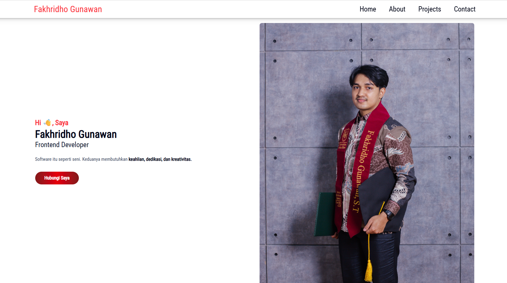
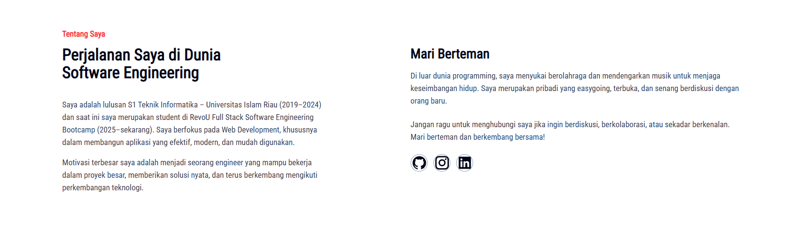
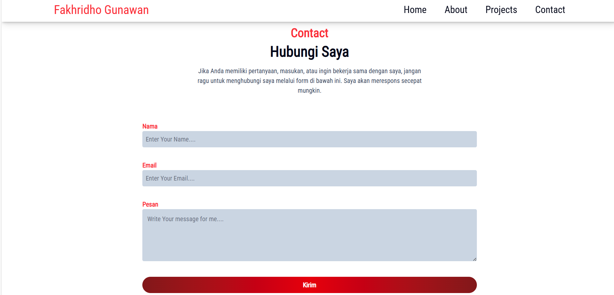

[](https://classroom.github.com/a/KTVBmApB)
# Revou Student Portfolio

# Portfolio Website – Fakhridho Gunawan

Ini adalah website portfolio pribadi yang saya bangun sebagai bagian dari proses pembelajaran dalam membangun website menggunakan HTML dan CSS (serta Tailwind CSS). Website ini menampilkan profil, perjalanan karier, project-project yang pernah saya buat, dan form kontak agar pengunjung dapat menghubungi saya.

Website ini terus diperbarui seiring berkembangnya kemampuan saya dalam pengembangan web front-end.

## 🚀 Overview

Website portfolio ini terdiri dari beberapa section utama:

- Home / Hero – Menampilkan perkenalan singkat dan foto diri.

- About – Berisi perjalanan saya dalam dunia Software Engineering dan sedikit tentang kepribadian saya.

- Projects – Kumpulan project sederhana yang saya buat untuk melatih kemampuan front-end.

- Contact – Form untuk menghubungi saya, lengkap dengan input nama, email, dan pesan.

- Footer – Menampilkan informasi kontak, navigasi, dan social links.

Website ini dibuat dengan struktur HTML yang rapi serta styling menggunakan CSS dan Tailwind CSS untuk menghasilkan layout yang modern dan responsif.

## ⭐ Features Implemented

- Struktur HTML lengkap dan semantik (header, section, footer, dll.)

- Navigasi bekerja dengan baik

- Konten sudah tertata: Home, About, Projects, Contact

- Styling menggunakan Tailwind CSS dan custom CSS

- Desain responsif untuk tampilan mobile, tablet, dan desktop

- Efek hover pada tombol dan social icons

- Layout flex pada section home about projects dan footer

- Warna, typography, dan spacing yang konsisten

- Style form contact agar mudah dibaca dan digunakan

- Penggunaan border, shadow, dan background untuk mempercantik UI

- Hosted di GitHub Pages

## 🛠️ Technologies Used

Website ini dibuat menggunakan teknologi berikut:

HTML5 – Struktur konten dan layout utama

CSS3 – Custom styling tambahan

Tailwind CSS – Utility-first styling untuk mempercepat proses development

Git & GitHub – Version control dan hosting repository

GitHub Pages – Hosting website (deployment)

## 🌐 Demo Website 

| Deskripsi                                       | Link                                              |
| ----------------------------------------------- | ------------------------------------------------- |
| **Deployed Website** | https://revou-fsse-oct25.github.io/milestone-1-FakhridhoGunawan73/             |
| **Source Code Repository**                      | https://github.com/FakhridhoGunawan73         |

## 🖼️ Screenshots

Berikut adalah tampilan dari website portfolio ini:

📌 Homepage



📌 About Section



📌 Projects Section


📌 Contact Section



## 📁 Project Structure

Berikut struktur folder yang digunakan dalam project ini:

```bash
📁 milestone-1-Fakhridhogunawan73
│
├── 📁 assets
│ ├── 📁 document
│ ├── 📁 font
│ ├── 📁 images
│ └── 📁 screenshots
│
├── 📄 index.html
└── 📄 README.md
```

## 📌 How to Run the Project Locally

Clone repository:
```bash
git clone https://revou-fsse-oct25.github.io/milestone-1-FakhridhoGunawan73/
```

Buka folder project:
```bash
cd nama-repo
```

Buka file:

```bash
index.html
```

## 📬 Contact

Jika ingin berdiskusi, bertanya, atau bekerja sama dengan saya, silakan hubungi:

Email: fakhridhogunawan01@gmail.com

Lokasi: Bangkinang, Riau
